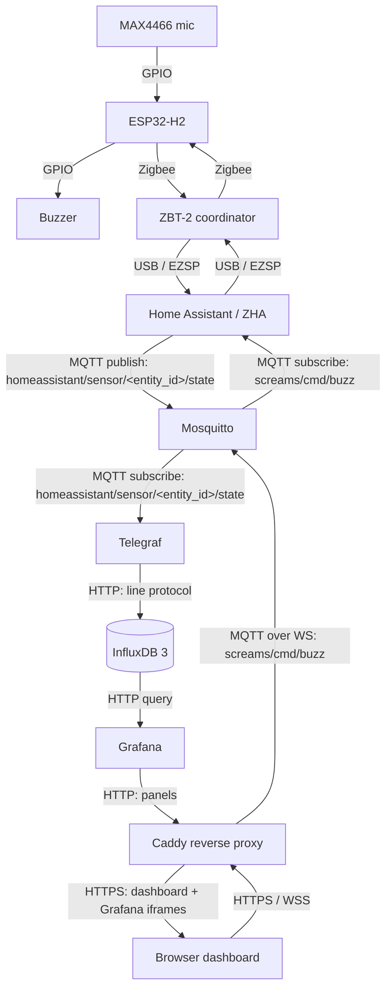

# IoT — room noise monitor

A 1DV027 course project. Measures noise level in a room and visualises it over time in a Grafana dashboard. An ESP32 with a microphone reads audio, computes a per-second loudness value, and ships it to a TIG stack running locally in Docker.

## Stack

The TIG stack — Telegraf (ingest), InfluxDB 3 Core (storage), Grafana (dashboards) — with Mosquitto as the MQTT broker and Caddy reverse-proxying the UIs. The ESP32 is a Zigbee end device: it reports loudness over Zigbee to a ZBT-2 coordinator paired with Home Assistant, which bridges the readings to MQTT via `mqtt_statestream`. From there, Telegraf subscribes and writes to InfluxDB, and Grafana queries InfluxDB.

## Data flow

Sensor readings travel up the left-hand chain; the Buzz button rides the same broker back down through HA.

## MQTT topics & payloads

Every MQTT topic the system uses, what publishes / subscribes to it, and the payload shape on the wire.

| Topic                                    | Direction                   | Payload                                                                                                                        | Rate                         | QoS / Retain | Notes                                                                                                                                                                                                                                                                                                    |
| ---------------------------------------- | --------------------------- | ------------------------------------------------------------------------------------------------------------------------------ | ---------------------------- | ------------ | -------------------------------------------------------------------------------------------------------------------------------------------------------------------------------------------------------------------------------------------------------------------------------------------------------- |
| `homeassistant/sensor/<entity_id>/state` | HA → broker → Telegraf      | Float as ASCII (e.g. `342.7`) — the raw RMS scalar from the ADC window, unitless                                               | 10 Hz                        | 0 / no       | Published by HA's `mqtt_statestream` after ZHA receives a Zigbee `Analog Input 0x000C` Report Attributes from the H2. Telegraf's `mqtt_consumer` parses the value as a float and writes it to InfluxDB as `audio.rms` (see [telegraf/telegraf.conf](telegraf/telegraf.conf)).                            |
| `screams/cmd/buzz`                       | Browser → broker → HA       | Literal string `1` — content is ignored, the message itself is the trigger (see [web/static/app.js:43](web/static/app.js#L43)) | On user click (sporadic)     | 0 / no       | Browser publishes over MQTT-over-WSS through Caddy. HA automation subscribes and fires `zha.issue_zigbee_cluster_command` with On/Off cluster `0x0006`. ACL restricts the `buzzer` user to _write-only_ on `screams/cmd/#` — defense-in-depth so a leaked browser credential cannot read sensor traffic. |

Topic naming follows two conventions: HA-owned topics live under `homeassistant/…` because that's where `mqtt_statestream` puts them by default, and project-owned topics live under `screams/…` (the working name for the sensor). The two namespaces don't overlap, which keeps the ACL straightforward.

## Key decisions

**RMS is computed on the device, not in the backend.** The microphone is sampled at 8 kHz and reduced to one RMS (loudness) scalar per 100 ms window, published at 10 Hz. The driving reason is _privacy_: raw audio samples can be reconstructed into audible speech, and a database holding them would effectively be a permanent wiretap. An RMS-over-time stream is just a loudness curve with no phase or frequency content — not reversible into audio. As a side benefit, this cuts the data rate by ~400× and means downstream queries never have to decimate raw samples.

**dB values in the dashboard are relative, not calibrated.** Grafana converts the raw RMS scalar to a decibel scale with `20 * log10(rms / noise_floor)`, where `noise_floor` is an observed value picked during a quiet moment — not measured against a reference SPL meter (which would require a calibrated source like a 94 dB piston phone). The numbers are useful for relative comparison ("scream is N dB above background") and should not be read as real-world dB SPL.

**Zigbee link-layer encryption is built in.** The device↔coordinator hop is encrypted by default — network and APS keys are negotiated at join time — so I didn't need to wire up a separate crypto layer for that segment. Espressif's `esp-zigbee-lib` is used to handle the pairing.

**Buzzer credentials never ship in the public bundle.** They live in `.env` and are served by Caddy at `/whoami`, which is gated by Cloudflare Access — only an authenticated owner gets them. The MQTT ACL also restricts the `buzzer` user to write-only on `screams/cmd/#` as defense-in-depth.

**Mixed auth: public dashboard, gated controls.** Cloudflare Access gates three paths under the public hostname; the rest is open:

| Path              | Who        | What                                                  |
| ----------------- | ---------- | ----------------------------------------------------- |
| `/`, `/grafana/*` | everyone   | static page + read-only embedded charts               |
| `/signin`         | owner only | redirect endpoint — triggers login flow, lands at `/` |
| `/whoami`         | owner only | returns MQTT credentials as JSON to the frontend JS   |
| `/mqtt*`          | owner only | MQTT-over-WebSocket endpoint for the Buzz button      |

The `CF_Authorization` cookie is set by Cloudflare (HttpOnly, Secure, SameSite); the app never reads or writes it.

## Setup

Storage is **InfluxDB 3 Core** — the workload is just timestamped scalars at 10 Hz, which is what time-series engines are built for and what a general-purpose SQL store would handle awkwardly. Concretely: columnar time-ordered storage compresses fixed-rate streams tightly, and bucketing / retention / downsampling are first-class — exactly what Grafana's queries lean on. At one sensor and 10 Hz, Postgres would also work; the win is fit, not raw throughput.

## Reflection

### Frontend tech

Plain HTML, CSS, JS — no framework. Two moving parts (a Buzz button and Grafana iframes) don't warrant a build step. Picked **Grafana** over a JS charting library because I'd never used it and wanted to learn the full TIG stack.

### MQTT-over-WSS vs REST

**Push vs pull.** REST polls on a timer with HTTP-header overhead per request; MQTT-over-WSS opens one persistent socket and the broker pushes messages as they land. At 10 Hz that matters — polling would either lag or hammer the server — and the same WebSocket carries readings down _and_ the buzz command up, on one auth surface instead of two.

### Hardest integration step

Jumping between tools and understanding the overal project felt like it was the hardest part of the project. Understanding and thinkering each piece in isolation was fine. The slow part was context-switching back to a layer I'd touched earlier. I believe this was because these tools/technologies were new to me. It became much more easier to understand and configure at the end of the project when one is able to see the dataflow. I'm glad I used **Zigbee** rather than putting another WiFi device on the network. I don't like having more devices than necessary having access to the internet, and Zigbee plus the single ingress through Caddy + Cloudflare Access kept the attack surface smal.

It was a fun project overall

## Firmware

See the [firmware README](https://github.com/TiberiusGh/1dv027-iot/tree/main/firmware) for details on the ESP32-H2 build, wiring, and Zigbee setup.
