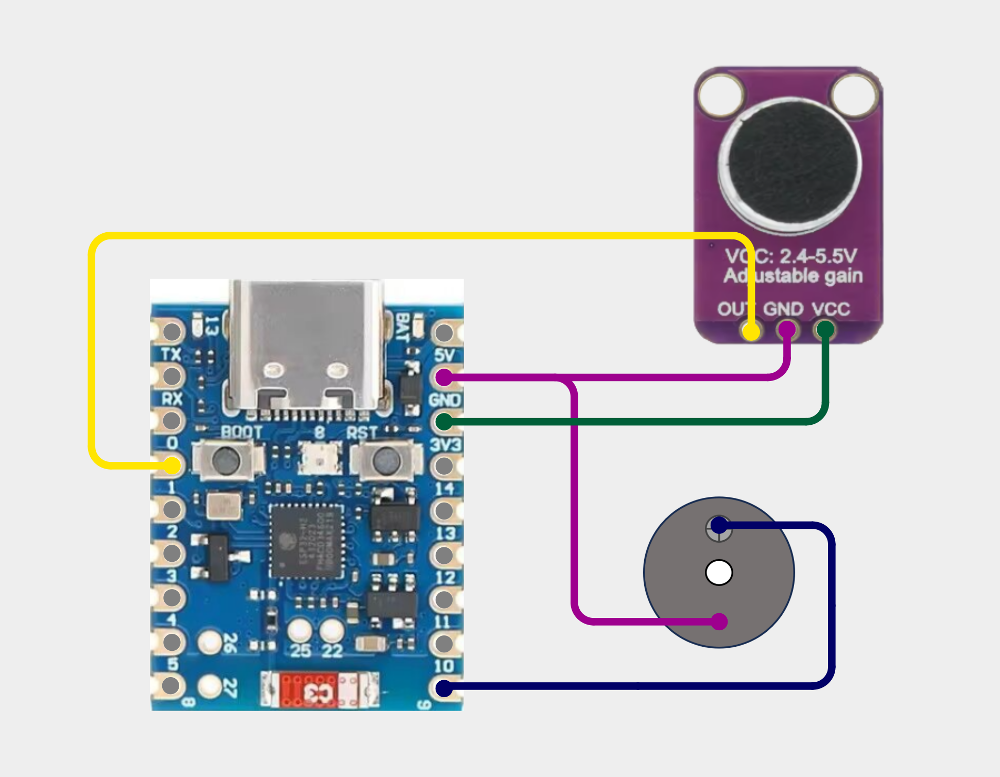

# Firmware — screams-sensor-h2

ESP32-H2 Zigbee end device. Publishes a loudness scalar 10× per second to a ZBT-2
coordinator running ZHA in Home Assistant, and also accepts a buzz command back
the other way (HA → ZHA → device → GPIO → piezo beep).

## Wiring



| ESP32-H2 pin | Connects to               |
| ------------ | ------------------------- |
| `3V3`        | MAX4466 `VCC`             |
| `GND`        | MAX4466 `GND`, buzzer `−` |
| `GPIO1`      | MAX4466 `OUT` (ADC1_CH0)  |
| `GPIO10`     | Buzzer `+`                |

## Build & flash

```sh
idf.py set-target esp32h2
idf.py build
idf.py flash monitor
```

A full erase is recommended after firmware changes that alter the Zigbee
attribute set, so the device re-pairs cleanly:

```sh
idf.py erase-flash flash monitor
```

## Layout

- [main/main.c](main/main.c) — wires the modules together
- [main/zigbee.c](main/zigbee.c) — radio, clusters, BDB join/rejoin/retry, On/Off attribute callback
- [main/source_adc.c](main/source_adc.c) — continuous ADC on GPIO1 at 8 kHz, 100 ms stddev windows, publishes the RMS scalar
- [main/buzzer.c](main/buzzer.c) — GPIO10 active-piezo driver, one-shot 200 ms pulse

## Key choices

**Zigbee end device, not router.** Battery-class role. Radio sleeps between
parent polls when idle. We don't relay traffic for other devices.

**AnalogInput cluster (0x000C), `present_value`.** Generic float channel.
Paired with a ZHA quirk ([../quirks/](../quirks/)) so Home Assistant exposes it
as `Loudness RMS` instead of the default Temperature/°C.

**10 Hz publish rate.** Each tick the firmware writes `present_value` locally
and sends a `Report Attributes` command. The rate is the resolution / Zigbee
airtime tradeoff. Speech is not recoverable from amplitude envelopes at any
rate (no phase, no frequency content) — the privacy property comes from never
transmitting raw samples, not from the rate.

**Channel mask narrowed to 11.** ZHA on the ZBT-2 is on channel 11; scanning
just that channel makes rejoin ~16× faster than scanning the whole 2.4 GHz band.

**Plugged in via USB, not battery.** Continuous ADC sampling + always-awake
radio averages 20–40 mA. A 1-year run on batteries would require a hardware
wake-on-sound front-end; with USB we sidestep that. A baby monitor whose
battery dies at 3 a.m. is a worse product than one with a cable.

**NVS retained across reboots** (`esp_zb_nvram_erase_at_start(false)`). The
device rejoins its prior network on power cycle without needing to re-pair.

**On/Off cluster (0x0006) + GPIO10 active piezo.** Receives a "buzz" command
from HA. On any `On` write, firmware drives GPIO10 HIGH for 200 ms — that's the
whole device-side contract. HA owns the on→off cycle in its automation (turn_on,
short delay, turn_off), so the device never has to fight HA's optimistic state
model.

## Sound capture path (designed with AI assistance)

The mic, sampling, and RMS choices were worked through in conversation
with an AI assistant. If you spot a misjudgement, please let me know by opening an issue or email me at tiberius.gherac@gmail.com.

- **MAX4466 electret mic, manual gain pot.** AGC mics (e.g. MAX9814) would
  actively flatten the loudness dynamic range we need to measure.
- **ADC at 8 kHz.** Nyquist gives 4 kHz of usable bandwidth — enough to capture
  the screechy 1–4 kHz energy of a baby cry. 2 kHz would under-report perceived
  loudness.
- **100 ms RMS window via stddev.** The mic biases around VCC/2, so raw RMS is
  dominated by the DC offset. Computing stddev per window auto-subtracts that
  bias (and tracks any drift with temperature / supply voltage).
- **dB-relative display in Grafana**, computed at the panel as
  `20 * log10(rms / noise_floor)`. Raw RMS stays in InfluxDB. Log scale matches
  human hearing and keeps quiet + loud both readable on one axis.
- **Gain pot tuned once at install.** Set so loud sounds approach the ADC top
  without clipping at 4095 — clipping permanently erases dynamic range.

## ZHA pairing

ZHA "Add device" must be open while the H2 boots. The signal handler retries
network steering every ~3 s on failure, so leave the pairing window open and
the H2 will join within a couple of attempts.
